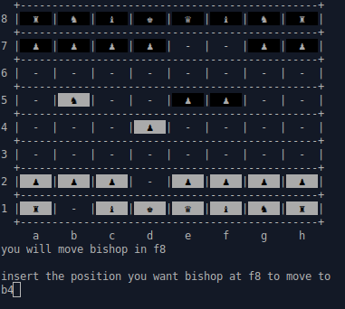

### chess-game

A simple chess game made in ruby , where two persons play against each other.This is played in the console terminal , there's still some features that are not included like Castling, promotion, en passant.

### To play 

You must have ruby installed on your pc to play

  * `clone this repository`
  * `go into the folder and open the terminal`
  * `in terminal use ruby game.rb`
  * `start playing!!` 
  
  
### Features

  * `validates player input`
  * `the game doesn't allow you to make ilegal moves`
  

### Not implemented

  * `save/load option`
  * `play against pc`
  * `castling`
  * `pawn promotion`
  * `en passant`
  * `50 moves rules`
  
 
